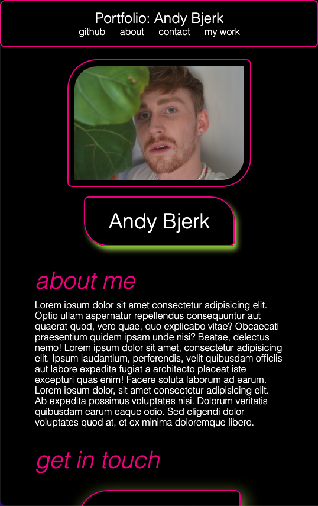

# challenge-02

# links 
![github] (http://github.com/savoryboi/)
![linkedIn] (http://linkedin.com/in/andybjerk)
![sather-audio] (http://savoryboi.github.io/sather-audio/)

# User story
> AS AN employer
>I WANT to view a potential employee's deployed portfolio of work samples
>SO THAT I can review samples of their work and assess whether they're a good candidate for an open position

# Criteria
>The portfolio includes navigation links to specific areas of the web page, an about section, contact info, and the work. Images of the deployed appications (or placeholders) should have a title and link to the deployed application. 

>The first image in the developer's work should be larger than the others. 

>The webpage should be responsive to the size of the screen and mobile devices. 

>Must include the developer's name and recent photo or avatar. 

# screenshot of deployed application

